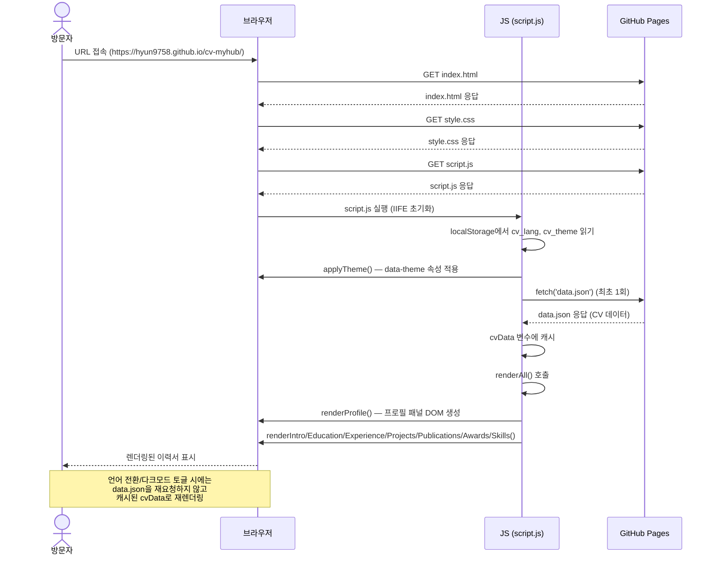

# MyHub — 최초 페이지 로드 시퀀스 다이어그램 v1

**액터**: 방문자, 브라우저, JS(`script.js`), GitHub Pages
**시작 이벤트**: URL 접속
**종료 이벤트**: 렌더링된 이력서 표시

## 변경 이력

| 날짜 | 버전 | 변경 내용 |
|---|---|---|
| 2026-08-20 | v1 | 최초 작성 |
