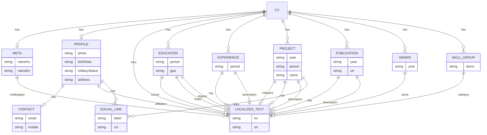

# MyHub — 데이터 스키마 정의서 v1

> PRD의 4번 챕터(데이터 스키마)에서 파생된 독립 문서입니다. 요구사항 참조 및 관리 방법(`data.json` 등)에 종속적인 서술은 제외하고, 순수 스키마만 정리합니다.

## 1. 스키마 개요

| 키 | 필드 구성 |
|---|---|
| `meta` | `nameKo`, `nameEn`, `roleBadges[]{ko,en}` |
| `profile` | `photo`, `birthDate`, `militaryStatus`, `address`, `contact{email,mobile}`, `affiliation{ko,en}`, `social[]{label,url}` |
| `intro` | `{ko,en}` |
| `education[]` | `school{ko,en}`, `major{ko,en}`, `degree{ko,en}`, `period`, `gpa` |
| `experience[]` | `period`, `org{ko,en}`, `description{ko,en}` |
| `projects[]` | `category{ko,en}`, `year`, `period`, `role{ko,en}`, `name`, `description{ko,en}`, `links[]{label,url}` |
| `publications[]` | `year`, `title{ko,en}`, `description{ko,en}`, `url` |
| `awards[]` | `year`, `name{ko,en}` |
| `skills[]` | `category{ko,en}`, `items[]` |

## 2. 공통 규칙

- 언어별로 다른 텍스트가 필요한 필드는 `{ ko: string, en: string }` 형태의 지역화 객체(Localized Text)로 표현한다.
- 기간(`period`), 연도(`year`), 이메일, URL 등 언어 무관 값은 단일 문자열로 표현한다.
- 배열 필드가 빈 배열이거나, 문자열 필드가 빈 문자열인 경우 "값 없음"으로 간주한다.

## 3. ERD (Mermaid)

## 변경 이력

| 날짜 | 버전 | 변경 내용 |
|---|---|---|
| 2026-08-20 | v1 | PRD v1.1 데이터 스키마(4장)에서 파생하여 최초 작성 |
